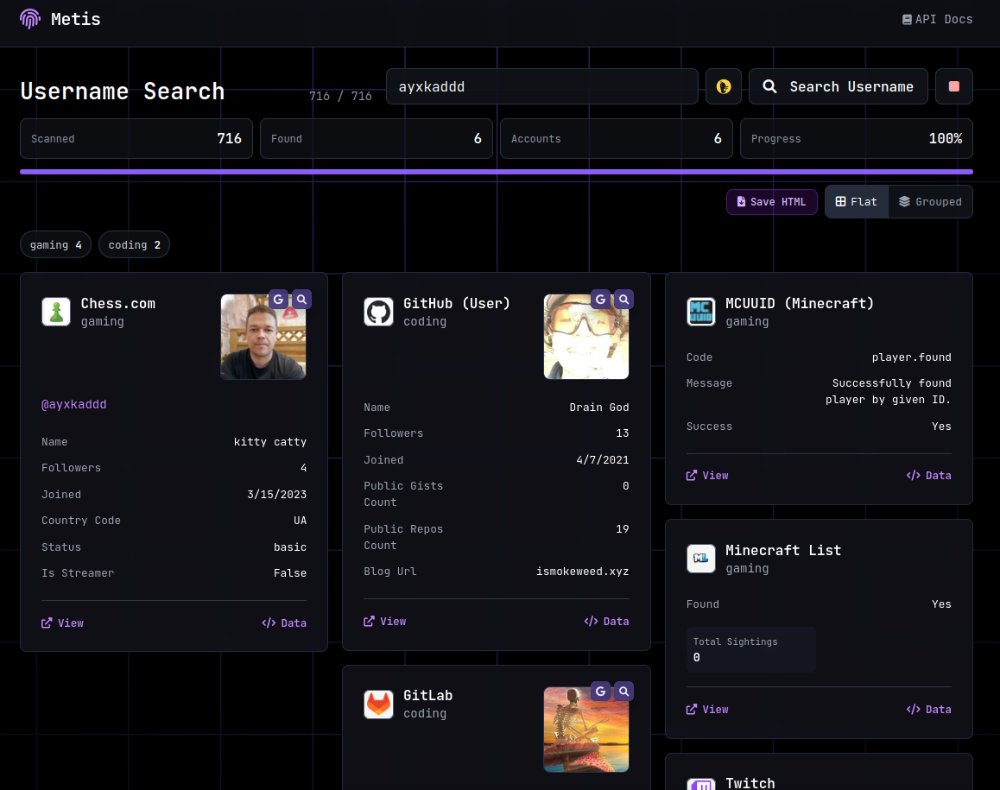

# Metis — Username OSINT Reconnaissance Engine

Metis is an autonomous, high-performance open-source intelligence (OSINT) tool designed to scan 700+ web platforms for usernames, extract rich profile metadata, and generate interactive HTML intelligence reports.

Metis operates in **two modes**:
1. **Interactive CLI**: Fast terminal scanning with live progress, colored indicators, result tables, and direct HTML/JSON report generation.
2. **Web Service**: Complete FastAPI web application providing real-time Server-Sent Events (SSE) streaming, interactive card layouts (Masonry & Grouped by category), avatar preview modals, and one-click HTML report export.

---

## Preview



## Quick Start

### Installation

```bash
git clone https://github.com/ayxkaddd/metis

cd metis

# Create virtual environment and activate
python3 -m venv venv
source venv/bin/activate

# Install dependencies
pip install -r requirements.txt
```

---

## Mode 1: Command Line Interface (CLI)

### Basic Search
```bash
python main.py johndoe
```

### Save Styled HTML Report
```bash
# Save an interactive standalone HTML report
python main.py johndoe -o johndoe_report.html

# Or explicitly using --html
python main.py johndoe --html report.html
```

### Filter by Categories
Filter scans by specific platform categories (e.g. `coding`, `social`, `tech`, `gaming`, `finance`):
```bash
python main.py johndoe -c coding,social,tech -o dev_report.html
```

### Include Search Engines & Tune Concurrency
```bash
python main.py johndoe --ddg -t 40 --timeout 15 -o full_scan.html
```

### CLI Options
| Argument | Description |
| :--- | :--- |
| `username` | Target username to investigate |
| `-o, --output <file>` | Save output (`.html` for HTML report, `.json` for raw JSON) |
| `--html <file>` | Explicitly save interactive, styled HTML report |
| `--json <file>` | Save raw results to a JSON file |
| `-c, --category <list>` | Comma-separated categories to scan (`coding`, `social`, `tech`, etc.) |
| `--no-extract` | Disable deep profile extraction (`socid-extractor`) |
| `--ddg` | Include DuckDuckGo search queries |
| `-t, --concurrency <n>` | Max concurrent HTTP connections (default: `30`) |
| `--timeout <sec>` | Timeout per website in seconds (default: `10`) |
| `-v, --verbose` | Enable verbose debug logging |

---

## Mode 2: Web Service

Launch the standalone web service:
```bash
python main.py --web
```
Custom host and port:
```bash
python main.py --web --host 0.0.0.0 --port 8000
```

Open your browser at:
- **Web UI**: `http://localhost:8000`
- **Interactive Swagger API Docs**: `http://localhost:8000/docs`
